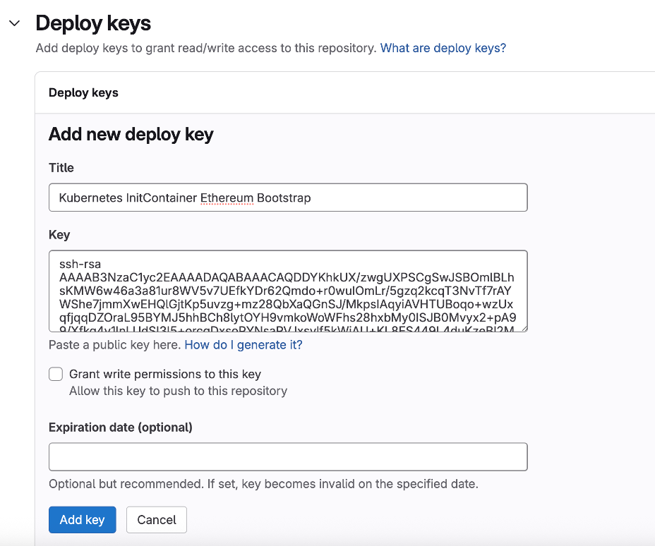

# วิธีการ Deploy Ethereum node

เตรียม git repository สำหรับเก็บ configuration ของ Ethereum (assume ว่าใช้ Gitlab)

## ขั้นตอนที่ 1: สร้าง SSH Key Pair

SSH key pair ประกอบด้วย public key และ private key เราจะใช้คีย์คู่นี้เพื่อให้ Kubernetes initContainer สามารถยืนยันตัวตนกับ GitLab ได้

1.  เปิด Terminal หรือ Command Prompt บนเครื่องคอมพิวเตอร์ของคุณ 

2.  รันคำสั่งต่อไปนี้เพื่อสร้าง SSH key pair ใหม่: 

    ```bash
    ssh-keygen -t rsa -b 4096 -C "gitlab-k8s-initcontainer-config" -f ./gitlab-k8s-config-key -N ""
    ```

      * `-t rsa`: ระบุประเภทของคีย์เป็น RSA 
      * `-b 4096`: ระบุขนาดของคีย์เป็น 4096 bits (เพื่อความปลอดภัยที่สูงขึ้น) 
      * `-C "gitlab-k8s-initcontainer-config"`: เป็น comment หรือป้ายกำกับสำหรับคีย์นี้ (คุณสามารถเปลี่ยนเป็นชื่อที่สื่อความหมายสำหรับคุณได้) 
      * `-f./gitlab-k8s-config-key`: ระบุชื่อไฟล์และตำแหน่งที่จะบันทึกคีย์ คำสั่งนี้จะสร้างไฟล์สองไฟล์ในไดเรกทอรีปัจจุบัน: 
          * `gitlab-k8s-config-key` (นี่คือ private key) 
          * `gitlab-k8s-config-key.pub` (นี่คือ public key) 
      * `-N ""`: สำคัญมาก กำหนด passphrase (รหัสผ่านสำหรับคีย์) เป็นค่าว่าง การทำเช่นนี้จำเป็นสำหรับระบบอัตโนมัติอย่าง initContainer เพราะจะไม่มีใครคอยป้อนรหัสผ่านให้ 

    **ข้อควรระวัง:** รักษาไฟล์ private key (`gitlab-k8s-config-key`) ของคุณให้ปลอดภัย อย่าเปิดเผยให้ใครทราบ 

## ขั้นตอนที่ 2: เพิ่ม Public Key ไปยัง GitLab Repository ในฐานะ Deploy Key

Deploy Key ช่วยให้ระบบภายนอก (ในที่นี้คือ Kubernetes pod) สามารถเข้าถึง repository ได้ 

1.  คัดลอกเนื้อหาของ public key: สามารถดูเนื้อหาของ public key ได้โดยใช้คำสั่ง: 

    ```bash
    cat /gitlab-k8s-config-key.pub | pbcopy # macOS
    ```

    หรือ

    ```bash
    cat /gitlab-k8s-config-key.pub | clip # windows
    ```

    คัดลอกผลลัพธ์ทั้งหมดที่ขึ้นต้นด้วย `ssh-rsa ...` และลงท้ายด้วย comment ที่คุณตั้งไว้ 

2.  ไปที่ GitLab repository: เปิดเว็บเบราว์เซอร์แล้วไปที่เช่น `git@gitlab.com:nontster/ethereum_bootstrap.git` (หรือ URL ที่เทียบเท่าบนเว็บ เช่น `https://gitlab.com/nontster/ethereum_bootstrap`) 

3.  ไปที่ส่วน Deploy Keys: 

      * ในหน้า repository ของคุณ มองหาเมนู Settings (การตั้งค่า) ที่แถบด้านซ้าย 
      * คลิกที่ Repository (ที่เก็บ) 
      * ขยายส่วน Deploy Keys (คีย์สำหรับการ Deploy) 

4.  เพิ่ม Deploy Key ใหม่: 

      * คลิกที่ปุ่ม Add deploy key 
      * Title: ตั้งชื่อที่สื่อความหมาย เช่น "Kubernetes InitContainer Config Sync" 
      * Key: วางเนื้อหา public key ที่คุณคัดลอกไว้ในช่องนี้ 
      * Grant write permissions to this key (ให้สิทธิ์การเขียนกับคีย์นี้): สำคัญมาก: ไม่ต้องเลือกช่องนี้ สำหรับการ clone เราต้องการแค่สิทธิ์อ่าน (read-only access) เท่านั้น ซึ่งปลอดภัยกว่า การให้สิทธิ์เขียนโดยไม่จำเป็นเป็นการเพิ่มความเสี่ยงด้านความปลอดภัย 
      * คลิก Add key 



## ขั้นตอนที่ 3: สร้าง Kubernetes Secret เพื่อเก็บ Private Key และ Known Hosts ของ GitLab

Clone git repository `https://github.com/nontster/ethereum-k8s-kustomize` มาบนเครื่องคอมพิวเตอร์ของคุณ 

```bash
git clone https://github.com/nontster/ethereum-k8s-kustomize.git
```

รับ SSH host key ของ `gitlab.com`: เพื่อหลีกเลี่ยงการถามยืนยัน host key แบบ interactive ตอนที่ initContainer พยายามเชื่อมต่อ ให้เราเพิ่ม host key ของ `gitlab.com` เข้าไปใน `known_hosts` ที่จะเก็บใน secret ด้วย รันคำสั่งนี้ใน terminal: 

```bash
ssh-keyscan gitlab.com
```

คัดลอกบรรทัดผลลัพธ์ที่ขึ้นต้นด้วย `gitlab.com ssh-rsa ...` (หรือ `gitlab.com ecdsa-sha2-nistp256...`) 

สร้าง Kubernetes resource ประเภท secret ดังตัวอย่าง 

```bash
kubectl create secret generic gitlab-repo-ssh-key \
 --from-file=ssh-privatekey=./gitlab-k8s-key \
 --from-literal=known_hosts='gitlab.com ssh-rsa AAAAB3NzaC1yc2EAAAADAQABAAABAQCsj2bNKTBSPIYDEGk9KxsGh3mySTRgMtXL583qmBp zeQ+jqCMRgBqB98u3z++J1sK1XHWfM9dyhSevkMwSbhoR8XIq/U0tCNyokEi/ueaBMCvbcT Hh07FcwzY92WK4Yt0aGROY5qX2UKSeOvuP4D6TPqKF1onrSzH9bx9XUf21EdWT/ia1NEKju nUqu1x0B/StKDHMOX4/OKyIzuS0q/T1z0ATthvasJFoPrAjkohTyaDUz2LN5JoH839hViyE G82yB+MjcFV5MU3N111QL3cVUCh93xSaua1N85qivl+siMkPGb05xR/En4iEY6K2XPASUEM aieWVNTRCtJ4S8H+9' \
 --namespace ethereum-dry-run=client -o yaml | pbcopy # macOS
```

นำ output ที่ได้ไปใส่ในไฟล์ `_common/secrets.yaml` แทนที่ secret ชื่อ `gitlab-repo-ssh-key` เช่น 

```yaml
apiVersion: v1
data:
  known_hosts: Z210bGF1LmNvbSBzc2gtcnNhIEFBQUFCM056YUMxeWMyRUFBQUFEOVFBQkFBQUJBUUNzajJiTktUQlNwSVLERUdrOU
  ssh-privatekey: LS0tLS1CRUdJT1BPUEVOUINIIFBSSVZBVEUgSOVZLS0tLS KYjNCbGJuTnphQzFyWlhrdGRqRUFBQUFBQkc1dmJ
kind: Secret
metadata:
  name: gitlab-repo-ssh-key
```

ถ้าหากต้องการเปลี่ยน jwtsecret สามารถสร้าง secret ใหม่โดยใช้คำสั่ง 

```bash
export JWT=$(openssl rand -hex 32)
kubectl create secret generic jwtsecret --from-literal=jwtsecret=$JWT --dry-run -o yaml | pbcopy # macOS
```

## ขั้นตอนที่ 4: สร้าง configuration ตั้งต้นสำหรับ execution client consensus client และ validator client 

Clone git repository จาก private Gitlab repository ที่เตรียมไว้ เช่นในตัวอย่างใช้ https://gitlab.com/nontster/ethereum_bootstrap 

```bash
git clone git@gitlab.com:nontster/ethereum_bootstrap.git
```

copy script และ environment variable configuration file ต่อไปนี้เข้าไปใน directory 

  * `generate_genesis_data-el.sh`
  * `generate_genesis_data.sh`
  * `values.env`

สร้าง directory ชื่อ config 

```bash
mkdir -p config
```

สร้าง configuration ใหม่โดย execute shell script ดังต่อไปนี้ 

```bash
sh generate_genesis_data-el.sh
sh generate_genesis_data.sh
git add .
git commit -m "Initial"
git push
```

จะได้ไฟล์ใน Remote git repository ดังตัวอย่างในภาพ 

  * config 
  * vc/data 
  * README.md 

## การ Deploy Ethereum node ใน EKS Cluster

## ขั้นตอนที่ 1: แก้ไข configuration ให้ตรงกับการใช้งานจริง 

Clone Kubernetes deployment manifests ของ Ethereum node ถ้าหากยังไม่ได้ clone มาในขั้นตอนก่อนหน้านี้ 

```bash
git clone https://github.com/nontster/ethereum-k8s-kustomize.git
cd ethereum-k8s-kustomize
code . # เปิด vscode เพื่อแก้ไข
```

`base/_common/kustomization.yaml` 

```yaml
apiversion: kustomize.config.k8s.io/vlbetal
kind: Kustomization
resources:
- namespace.yaml
- role.yaml
- secrets.yaml
- pv.yaml
- pvc.yaml
configMapGenerator:
  name: env-vars
  literals:
    - CHAIN_ID=9555
    - FEE_RECIPIENT=0x5F920028E98ab2d1d6c6Cf4E4B41a07F4bB55555
  name: external-network-config
  literals:
    - GETH_EXTERNAL_IP="10.0.8.10:"
    - GETH_EXTERNAL_PORT="31100"
    - BEACON_EXTERNAL_IP="10.0.8.109"
    - BEACON_EXTERNAL_PORT="31300"
  name: git-repo-config
  literals:
    - GIT_REPO_URL="git@gitlab.com:nontster/ethereum_bootstrap.git"
```

1.  แก้ไข `CHAIN_ID` `FEE_RECIPIENT` (ใช้ค่าจาก `WITHDRAWAL_ADDRESS` ใน `values.env`) 

2.  แก้ไข `GETH_EXTERNAL_IP` `BEACON_EXTERNAL_IP` โดยใช้ IP ของ EKS worker node 

3.  สำหรับ `GETH_EXTERNAL_PORT` `BEACON_EXTERNAL_PORT` ถ้าไม่ซ้ำกับ NodePort อื่นใน cluster ก็ไม่จำเป็นต้องเปลี่ยน แต่ถ้าต้องเปลี่ยนให้ตามไปเปลี่ยน nodePort ใน `base/geth/service-p2p.yaml` และ `base/beacon/service-p2p.yaml` ให้ตรงกันด้วย 

4.  แก้ไข `GIT_REPO_URL` ให้ตรงกับ Gitlab repository ที่ใช้จริง 

5.  ใน `pv.yaml` แก้ไข `capacity.storage` เป็นขนาดของ EFS filesystem ที่ต้องการ `volumeHandle` ให้ตรงกับ AWS EFS filesystem Id ใน และ `pvc.yaml` แก้ไข `storageClassName` ให้ตรงกับ `storageClassName` ของ EFS CSI Driver ใน EKS Cluster 

    `base/_common/pv.yaml` 

    ```yaml
    apiversion: v1
    kind: PersistentVolume
    metadata:
      name: efs-pv
    spec:
      capacity:
        storage: 10Gi
      volumeMode: Filesystem
      accessModes:
        - ReadwriteMany
      storageClassName: efs-sc
      persistentVolumeReclaimPolicy: Retain
      csi:
        driver: efs.csi.aws.com
        volumeHandle: fs-0ccc8761fb6ea0572
    ```

    `base/_common/pvc.yaml` 

    ```yaml
    apiversion: v1
    kind: PersistentVolumeClaim
    metadata:
      name: efs-claim
    spec:
      accessModes:
        - ReadwriteMany
      storageClassName: efs-sc
      resources:
        requests:
          storage: 10Gi
    ```

6.  ใน `namespace.yaml` แก้ไข ชื่อ namespace ที่ต้องการ deploy Ethereum node ลงไป 

    `base/_common/namespace.yaml` 

    ```yaml
    apiversion: v1
    kind: Namespace
    metadata:
      name: ethereum
    ```

## ขั้นตอนที่ 2: Deploy Ethereum node 

1.  Update kubeconfig 

    ```bash
    aws eks update-kubeconfig --region <aws region> --name <eks cluster name>
    ```

2.  Deploy 

    ```bash
    kubectl apply -k overlays/dev
    ```

    OUTPUT: 

    ```
    namespace/ethereum created
    serviceaccount/beacon created
    serviceaccount/geth created
    serviceaccount/validator created
    role.rbac.authorization.k8s.io/service-reader created
    clusterrole.rbac.authorization.k8s.io/beacon created
    clusterrole.rbac.authorization.k8s.io/geth created
    rolebinding.rbac.authorization.k8s.io/beacon-read-services created
    rolebinding.rbac.authorization.k8s.io/geth-read-services created
    rolebinding.rbac.authorization.k8s.io/validator-read-services created
    clusterrolebinding.rbac.authorization.k8s.io/beacon created
    clusterrolebinding.rbac.authorization.k8s.io/geth created
    configmap/beacon created
    configmap/env-vars-h8f8gt77bk created
    configmap/external-network-config-hf8hb45k6d created
    configmap/git-repo-config-675687t99d created
    secret/gitlab-repo-ssh-key created
    secret/jwtsecret created
    service/beacon created
    service/beacon-0 created
    service/geth created
    service/geth-0 created
    service/validator created
    persistentvolume/efs-pv created
    persistentvolumeclaim/efs-claim created
    statefulset.apps/beacon created
    statefulset.apps/geth created
    statefulset.apps/validator created
    prometheusrule.monitoring.coreos.com/beacon created
    prometheusrule.monitoring.coreos.com/geth created
    servicemonitor.monitoring.coreos.com/beacon created
    servicemonitor.monitoring.coreos.com/geth created
    ```

3.  ดู ว่า pod ถูกสร้างเรียบร้อยหรือไม่ ทุก pod ต้องมีสถานะเป็น Running 

    ```bash
    kubectl get pon ethereum --watch
    ```

    OUTPUT: 

    ```
    NAME         READY   STATUS      RESTARTS   AGE
    beacon-0     Init:0/1   0/1      0          15s
    geth-0       Init: 0/2   0/1      0          15s
    validator-0  Init: 0/1   0/1      0          15s
    beacon-0     Init:0/1   0/1      0          17s
    validator-0  Init: 0/1   0/1      0          17s
    geth-0       Init: 0/2   0/1      0          18s
    geth-0       0/1     Init:1/2   0          27s
    geth-0       0/1     PodInitializing 0          33s
    geth-0       1/1     Running     0          35s
    beacon-0     0/1     PodInitializing 0          39s
    beacon-0     1/1     Running     0          46s
    validator-0  0/1     PodInitializing 0          51s
    validator-0  1/1     Running     0          58s
    ```

4.  ดู Log ของ validator ว่ามี Error หรือไม่ 

    ```bash
    kubectl logs -f validator-0 -n ethereum
    ```

5.  ถ้าติดตั้ง `kube-prometheus-stack` และ Geth dashboard เอาไว้สามารถตรวจสอบได้โดยดูจาก dashboard 

    ```bash
    kubectl port-forward svc/kube-prometheus-stack-grafana 8080:80 -n monitoring
    ```

    adminUser: admin
    adminPassword: prom-operator 